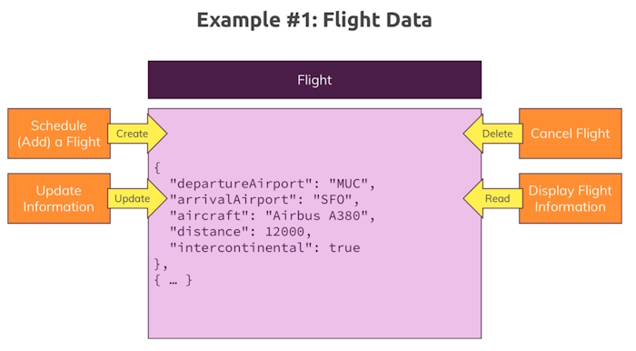

# Understanding the basics & CRUD

Databases, Collections and documents are automatically created when you start working with them.


**Note:** ``collections`` are the equivalent of SQL tables and ``documents`` are the equivalent of a single record on a table.

## Create Databases and Collections

```bash
    use flights
```

### Add collections

```bash
    db.flightData.insertOne({})
```

Where:

**db** is a database command.

**flightData** is the name collection.

**insertOne** is the document method.

**{}** is the document that is in JSON format.

## Understanding JSON data

An example of JSON data.

```bash
    [
      {
        "departureAirport": "MUC",
        "arrivalAirport": "SFO",
        "aircraft": "Airbus A380",
        "distance": 12000,
        "intercontinental": true
      },
      {
        "departureAirport": "LHR",
        "arrivalAirport": "TXL",
        "aircraft": "Airbus A320",
        "distance": 950,
        "intercontinental": false
      }
    ]
```

This is an array of two JSON documents.

We will add each document into ``flightData``.

Copy:

```bash
    {
        "departureAirport": "MUC",
        "arrivalAirport": "SFO",
        "aircraft": "Airbus A380",
        "distance": 12000,
        "intercontinental": true
    }
```

Add into:

```bash
    db.flightData.insertOne()
```

You will get a similar success output.

> {     
>   acknowledged: true,     
>   insertedId: ObjectId("65c03d5702eb29694d65fd8e")        
> }

MongoDB adds a unique **id** object to each document.

> ObjectId("65c03d5702eb29694d65fd8e")

**Note:** that you can add the double quotes around the **key** part of each field if you want. If you have spaces in your key (don't do it) you would have to use double quotes.

Once you have added both records into the collection you can list each document with.

```bash
    db.flightData.find()
```

this will list.

> [     
>   {       
>     _id: ObjectId("65c03caf02eb29694d65fd8d"),        
>     departureAirport: 'MUC',      
>     arrivalAirport: 'SFO',        
>     aircraft: 'Airbus A380',      
>     distance: 12000,      
>     intercontinental: true        
>   },      
>   {       
>     _id: ObjectId("65c03d5702eb29694d65fd8e"),        
>     departureAirport: 'LHR',      
>     arrivalAirport: 'TXL',        
>     aircraft: 'Airbus A320',      
>     distance: 950,        
>     intercontinental: false       
>   }       
> ]

**Note:** MongoDB stores the keys without the double quotes.

## JSON vs BSON


MongoDB takes the JSON data and stores it in **Binary JSON** (BSON). This compacts the JSON making it faster to work with.

**Note:** the ``_id: ObjectId("65c03d5702eb29694d65fd8e")`` id object isn't valid JSON data but MongoDB is able to work with these id's.

Now add this document.

```bash
    db.fightData.insertOne({departureAirport: "MEL", arrivalAirport: "EDI"})
```

Output.

> [     
>   {       
>     _id: ObjectId("65c03caf02eb29694d65fd8d"),        
>     departureAirport: 'MUC',      
>     arrivalAirport: 'SFO',        
>     aircraft: 'Airbus A380',      
>     distance: 12000,      
>     intercontinental: true        
>   },      
>   {       
>     _id: ObjectId("65c03d5702eb29694d65fd8e"),        
>     departureAirport: 'LHR',      
>     arrivalAirport: 'TXL',        
>     aircraft: 'Airbus A320',      
>     distance: 950,        
>     intercontinental: false       
>   },      
>   {       
>     _id: ObjectId("65c048d402eb29694d65fd90"),        
>     departureAirport: 'MEL',      
>     arrivalAirport: 'EDI'     
>   }       
> ]

Your documents don't have to have the same schema but you also have to be able to interrogate the data so you have to be aware of the different schemas.

Also note that MongoDB adds id objects for you but you don't have to use them. You just have to be aware that each id has to be unique.

You can add this.

```bash
    db.fightData.insertOne({departureAirport: "MEL", arrivalAirport: "EDI", _id: "melbourne-edinburgh-1"})
```

Output.

> {     
>     _id: 'melbourne-edinburgh-1',     
>     departureAirport: 'MEL',      
>     arrivalAirport: 'EDI'     
> }

## CRUD operations and MongoDB


Imagine you have a website that uses your MongoDB data. You need to be able to manage this data.



## Finding, inserting, updating and deleting elements

### delete data

```bash
    db.flightData.deleteOne({ departureAirport: "MUC" })
```

Returns:

> { acknowledged: true, deletedCount: 1 }

**Note:** is there were two documents with departureAirport equals "MUC" then ``deleteOne()`` would delete the first document MongoDB finds.

### Update data

We want to add another field into a document.

```bash
    db.flightData.updateOne({distance: 950}, {$set: {marker: 'delete'}})
```

**$set** is an atomic operator and the ``updateOne()`` method must contain one. Whenever you see something in MongoDB with a **$** it is a reserved operator.

You use **$set**  to describe the changes you want to make with an update method to add another field. If the ``marker`` field already exists in the document it will update the ``marker`` field to the value of ``delete``.

**Note:** in the example above we use single quotes. Either single or double quotes will work and in the latest version of the **mongosh** shell all documents will be shown with single quotes for string data.

What if I want to add the ``marker`` field to every document?

```bash
    db.flightData.updateMany({}, {$set: {marker: 'toDelete'}})
```

The empty brackets says change all documents. Now all documents have a field named ``marker`` with a value of ``toDelete``.

We can now use this field to delete all documents.

We have a couple of methods to do this. The first will delete all documents unconditionally.

```bash
    db.flightData.deleteMany({})
```

Or if we want to filter certain documents we can do this.

```bash
    db.flightData.deleteMany({}, {marker: 'toDelete'})
```

Which in our case will do the same thing as the previous method.

### Understanding insertMany()

We have an empty collection at the moment so open up the ``flight.json`` file and copy the whole file. Now we are going to add a whole array of data.

```bash
    db.flightData.insertMany([
    ...   {
    .....     "departureAirport": "MUC",
    .....     "arrivalAirport": "SFO",
    .....     "aircraft": "Airbus A380",
    .....     "distance": 12000,
    .....     "intercontinental": true
    .....   },
    ...   {
    .....     "departureAirport": "LHR",
    .....     "arrivalAirport": "TXL",
    .....     "aircraft": "Airbus A320",
    .....     "distance": 950,
    .....     "intercontinental": false
    .....   }
    ... ]
    ... )
```

Output:

> {     
>   acknowledged: true,     
>   insertedIds: {      
>     '0': ObjectId("65c06e4402eb29694d65fd91"),        
>     '1': ObjectId("65c06e4402eb29694d65fd92")     
>   }       
> }

**Note** when you add an array the id's are very similar with only the last digit being different.

### Deeper dive into finding data

You can filter your ``find()`` method.

```bash
    db.flightData.find({departureAirport: 'LHR'})
```

You can do more complex searches. We can pass another object and use one of the special operators.

```bash
    db.flightData.find({distance: {$gt: 1000}})
```

Returns.

> [     
>   {       
>     _id: ObjectId("65c06e4402eb29694d65fd91"),        
>     departureAirport: 'MUC',      
>     arrivalAirport: 'SFO',        
>     aircraft: 'Airbus A380',      
>     distance: 12000,      
>     intercontinental: true        
>   }       
> ]

This doesn't pick up the document with a distance of 950.

We can also filter by ``findOne()`` to find the first document with the criteria.

```bash
    db.flightData.findOne({distance: {$gt: 800}})
```

It will bring back the document with the distance of 12000 because it is the first document that is greater that 800.

## update vs updateMany()

We can update a document using a filter.

```bash
    db.flightData.updateOne({_id: ObjectId("65c06e4402eb29694d65fd91")}, {$set: {delayed: true}})
```

Returns.

> {     
>     _id: ObjectId("65c06e4402eb29694d65fd91"),        
>     departureAirport: 'MUC',      
>     arrivalAirport: 'SFO',        
>     aircraft: 'Airbus A380',      
>     distance: 12000,      
>     intercontinental: true,       
>     delayed: true     
> }

You could also use.

```bash
    db.flightData.update({_id: ObjectId("65c06e4402eb29694d65fd91")}, {$set: {delayed: true}})
```

Returns:

> DeprecationWarning: Collection.update() is deprecated. Use updateOne, updateMany, or bulkWrite.       
> {     
>   acknowledged: true,     
>   insertedId: null,       
>   matchedCount: 1,        
>   modifiedCount: 0,       
>   upsertedCount: 0        
> }

This will report back that no document was modified because we had already modified this document.

If we change ``delayed`` to false.

```bash
    db.flightData.update({_id: ObjectId("65c06e4402eb29694d65fd91")}, {$set: {delayed: true}})
```

This will update the document

> {     
>   acknowledged: true,     
>   insertedId: null,       
>   matchedCount: 1,        
>   modifiedCount: 1,       
>   upsertedCount: 0        
> }

You have to be careful with the ``update()`` method. In earlier versions of MongoDB you could have done.

```bash
    db.flightData.update({_id: ObjectId("65c06e4402eb29694d65fd91")}, {delayed: true})
```

This would have replaced the document with the ObjectId with ``{delayed: true}`` as the only field in the document (besides the _id).

We should avoid using it and use the newer ``updateOne()`` and ``updateMany()`` methods instead.

If you want to replace a document you can use this.

```bash
    db.flightData.replaceOne({_id: ObjectId("65c06e4402eb29694d65fd91")}, {
    ...     "departureAirport": "MUC",
    ...     "arrivalAirport": "SFO",
    ...     "aircraft": "Airbus A380",
    ...     "distance": 12000,
    ...     "intercontinental": true
    ...   })
```

Returns.

> {     
>   acknowledged: true,     
>   insertedId: null,       
>   matchedCount: 1,        
>   modifiedCount: 1,       
>   upsertedCount: 0        
> }

You keep the original id and change the document back to the original document from the ``flight.json`` file.

This is the safer way to replace a document.

## Understanding find() and the cursor object

Add passengers array from passengers.json. Then run ``find()``.

You will not see all of the records but at the bottom of the documents returned you will see a message to type in ``"it"`` to see more documents.

This is a **cursorObject** that is sending you back a block of 20 documents depending on how many documents there are in the collection. Remember the collection could have millions of documents.

The **cursorObject** will use ``it`` to allow you to cycle through the results.

``find()`` just gives us back a cursor.

The following will send back all documents in a collection.

```bash
    db.passengers.find().toArray()
```

You can count the number of documents in a collection with.

```bash
    db.passengers.countDocuments()
```

The ``mongosh`` shell is based on JavaScript so you could run this JavaScript function.

```bash
    db.passengers.find().forEach((passenger) => {printjson(passenger)})
```

This would do the same as ``.toArray()``.

It is important to remember that the ``find()`` method is a cursor.

## Understanding projection

So far we have been using ``find()`` to send back all fields in each document. What if we want to send back a sunset of the fields. This is called a **projection**.

In ``passengers`` we have three fields, _id, name, age. To use projection and send back the name of the passenger.

```bash
    db.passengers.find({}, {name: 1})
```

**1** means send back the name field.

Returns.

> [     
>   ...            
>   { _id: ObjectId("65c0896302eb29694d65fda7"), name: 'Gordon Black' },        
>   { _id: ObjectId("65c089dc02eb29694d65fda8"), name: 'Alan Robson' },     
>   { _id: ObjectId("65c089ea02eb29694d65fda9"), name: 'Charley Robson' },      
>   { _id: ObjectId("65c089f702eb29694d65fdaa"), name: 'James Robson' }     
> ]

This isn't the output we were expecting!

The ``_id`` is a special field so it is always included.

You have to explicitly exclude it from the fields. You can do this with **0** and that means exclude that field.

```bash
    db.passengers.find({}, {name: 1, _id: 0}).toArray()
```

Returns.

>    ...        
>   { name: 'Gordon Black' },       
>   { name: 'Alan Robson' },        
>   { name: 'Charley Robson' },     
>   { name: 'James Robson' }        
> ]

We could include or exclude ``age`` as well but the projection configuration will ignore fields that aren't added.

It is important to note that the projection is happening on the MongoDB server and this is what we want to happen. It saves sending data down the wire that we don't need, ie, we don't impact our bandwidth.

## Embedded documents and arrays
