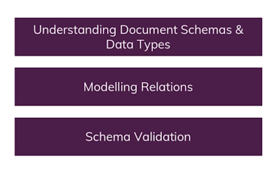

# 03 - Schemas and Relations: How to structure Documents

## Resetting Your Database

**Important:** We will regularly start with a clean database server (i.e. all data was purged) in this course.

To get rid of your data, you can simply load the database you want to get rid of (``use databaseName``) and then execute ``db.dropDatabase()``.

Similarly, you could get rid of a single collection in a database via ``db.myCollection.drop()``.

## Database schemas & Relations

What we will be looking at in this module.



## Why do we need schemas

MongoDB doesn't enforce any schemas. Documents don't have to use the same schema inside of one collection.

In reality you will probably have some kind of schema. As developers we will need it.

## Structuring documents

One method is to structure documents in a SQL format where every document has exactly the same fields and number of fields.

Another method is to have the same base fields in each document but then allow some of the documents to have extra fields.

Here is an example.

```json
    [
      {
        _id: ObjectId('65c4980b26beb523ade13a02'),
        name: 'A book',
        price: 12.99
      },
      {
        _id: ObjectId('65c4981826beb523ade13a03'),
        name: 'A T-shirt',
        price: 22.99
      },
      {
        _id: ObjectId('65c4986926beb523ade13a04'),
        name: 'A Computer',
        price: 1222.99,
        details: { cpu: 'I7 8770', memory: '16 Gb' }
      }
    ]
```

This is a more realistic case for MongoDB and you will see this in practice.

If we wanted to keep a more SQL format we could do this.

```json
    [
      {
        _id: ObjectId('65c4980b26beb523ade13a02'),
        name: 'A book',
        price: 12.99,
        details: null
      },
      {
        _id: ObjectId('65c4981826beb523ade13a03'),
        name: 'A T-shirt',
        price: 22.99,
        details: null
      },
      {
        _id: ObjectId('65c4986926beb523ade13a04'),
        name: 'A Computer',
        price: 1222.99,
        details: { cpu: 'I7 8770', memory: '16 Gb' }
      }
    ]
```

In MongoDB there is no preferred way to do things.

## Data types

Text 
Boolean
Number

* Integer (Int32)
* Long (Int64)
* Decimal
* ObjectId

IsoDate (2024-02-08) - Timestamp
Embedded document
Array

An example.

```bash
db.companies.insertOne({name: "Fresh Apples Inc", isStartup: true, employees: 33, funding: 12345678901234567890, details: {ceo: "James Robson"}, tags: [{title: "super"},{title: "perfect"}], foundingDate: new Date(), insertedAt: new Timestamp()})
```

Returns.

```json
    [
      {
        _id: ObjectId('65c4a6d526beb523ade13a05'),
        name: 'Fresh Apples Inc',
        isStartup: true,
        employees: 33,
        funding: 12345678901234567000,
        details: { ceo: 'James Robson' },
        tags: [ { title: 'super' }, { title: 'perfect' } ],
        foundingDate: ISODate('2024-02-08T10:03:01.949Z'),
        insertedAt: Timestamp({ t: 1707386581, i: 1 })
      }
    ]
```

**Note:** ``new Date()`` and ``new Timestamp()`` are JavaScript functions that are available because the shell is build in Node.js.

Also note that the ``funding`` value doesn't contain the number that we entered. This is because we put in a number that was too big.

If you need to put in really large numbers you might have to enter them as a string.

Let's drop the companies collection.

```bash
    db.companies.drop()
```

If you wanted to delete the database.

```bash
    db.companyData.dropDatabase()
```
