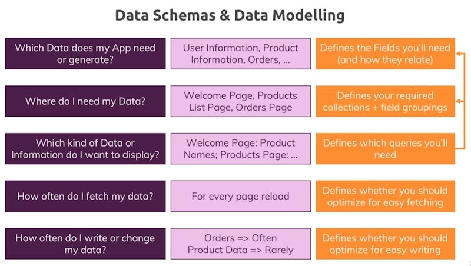
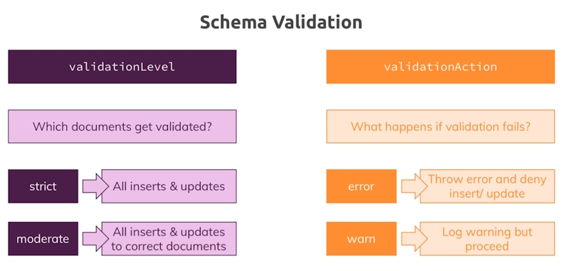

# 03 - Schemas and Relations: How to structure Documents

## Resetting Your Database

**Important:** We will regularly start with a clean database server (i.e. all data was purged) in this course.

To get rid of your data, you can simply load the database you want to get rid of (``use databaseName``) and then execute ``db.dropDatabase()``.

Similarly, you could get rid of a single collection in a database via ``db.myCollection.drop()``.

## Database schemas & Relations

What we will be looking at in this module.


## Why do we need schemas

MongoDB doesn't enforce any schemas. Documents don't have to use the same schema inside of one collection.

In reality you will probably have some kind of schema. As developers we will need it.

## Structuring documents

One method is to structure documents in a SQL format where every document has exactly the same fields and number of fields.

Another method is to have the same base fields in each document but then allow some of the documents to have extra fields.

Here is an example.

```json
    [
      {
        _id: ObjectId('65c4980b26beb523ade13a02'),
        name: 'A book',
        price: 12.99
      },
      {
        _id: ObjectId('65c4981826beb523ade13a03'),
        name: 'A T-shirt',
        price: 22.99
      },
      {
        _id: ObjectId('65c4986926beb523ade13a04'),
        name: 'A Computer',
        price: 1222.99,
        details: { cpu: 'I7 8770', memory: '16 Gb' }
      }
    ]
```

This is a more realistic case for MongoDB and you will see this in practice.

If we wanted to keep a more SQL format we could do this.

```json
    [
      {
        _id: ObjectId('65c4980b26beb523ade13a02'),
        name: 'A book',
        price: 12.99,
        details: null
      },
      {
        _id: ObjectId('65c4981826beb523ade13a03'),
        name: 'A T-shirt',
        price: 22.99,
        details: null
      },
      {
        _id: ObjectId('65c4986926beb523ade13a04'),
        name: 'A Computer',
        price: 1222.99,
        details: { cpu: 'I7 8770', memory: '16 Gb' }
      }
    ]
```

In MongoDB there is no preferred way to do things.

## Data types

Text 
Boolean
Number

* Integer (Int32)
* Long (Int64)
* Decimal
* ObjectId

IsoDate (2024-02-08) - Timestamp
Embedded document
Array

An example.

```bash
db.companies.insertOne({name: "Fresh Apples Inc", isStartup: true, employees: 33, funding: 12345678901234567890, details: {ceo: "James Robson"}, tags: [{title: "super"},{title: "perfect"}], foundingDate: new Date(), insertedAt: new Timestamp()})
```

Returns.

```json
    [
      {
        _id: ObjectId('65c4a6d526beb523ade13a05'),
        name: 'Fresh Apples Inc',
        isStartup: true,
        employees: 33,
        funding: 12345678901234567000,
        details: { ceo: 'James Robson' },
        tags: [ { title: 'super' }, { title: 'perfect' } ],
        foundingDate: ISODate('2024-02-08T10:03:01.949Z'),
        insertedAt: Timestamp({ t: 1707386581, i: 1 })
      }
    ]
```

**Note:** ``new Date()`` and ``new Timestamp()`` are JavaScript functions that are available because the shell is build in Node.js.

Also note that the ``funding`` value doesn't contain the number that we entered. This is because we put in a number that was too big.

If you need to put in really large numbers you might have to enter them as a string.

Let's drop the companies collection.

```bash
    db.companies.drop()
```

If you wanted to delete the database.

```bash
    use companyData
    db.dropDatabase()
```

Another thing you can do is get statistics from a database

```bash
  use family

  db.stats()
```

Returns.

```json
  {
    db: 'family',
    collections: Long('1'),
    views: Long('0'),
    objects: Long('3'),
    avgObjSize: 54.333333333333336,
    dataSize: 163,
    storageSize: 36864,
    indexes: Long('1'),
    indexSize: 36864,
    totalSize: 73728,
    scaleFactor: Long('1'),
    fsUsedSize: 316198912,
    fsTotalSize: 8359411712,
    ok: 1
  }
```

## Numbers in more detail

```bash
  use numberData

  db.numbers.insertOne({a: 1})
```

A number value in this case is a 64 bit floating number.

If you want to specify a type you can use the following function.

```bash
  db.numbers.insertOne({b: NumberInt(1)})
```

In this case the number is a 32 bit int.

**Note:** the reason this happens is because the ``mongosh`` shell is based on JavaScript and JavaScript doesn't differentiate between number types. The are all 46 bit floating point numbers.

You can check the type of a field.

```bash
  typeof db.numbers.findOne().b
```

In my case I get an **undefined** result which is a bit disconcerting. If I do the same command on the ``a`` document I get the **number** result.

## How to derive your data structure requirements



## Understanding relations


You can nest or embed documents or you can create related collections (references).

In the first reference example you are using a user and their favourite books. If you have a lot of users who have the same favourite books there is a lot of redundancy. When you have to change the spelling of one favourite book you have to go through all documents to change the spelling where the book name is used.

Better to create a customers collection and a books collection and relate the two collections to each other.

## One-one relations (embedded)

Where one patient has one aliments summary only, so one patient, one summary.

An example.

```bash
  db.patients.insertOne({name: "Alan Robson", age: 71, diseaseSummary: "summary-alan-1"})
```

Create another collection.

```bash
  db.diseaseSummaries.insertOne({_id: "summary-alan-1", diseases: ["bad back", "neck ache", "ear ache"]})
```

To query.

```bash
  db.patients.findOne()
```

Will find the one and only patient. But I want to find that patients diseases.

I could do this.

```bash
  db.patients.findOne().diseaseSummary
```

It returns.

> summary-alan-1

This still doesn't give me what I need. I could create a variable.

```bash
  let dsid = db.patients.findOne().diseaseSummary
```

Now if I type

```bash
  dsid
```

It will return.

> summary-alan-1

I can use this variable.

```bash
  db.diseaseSummaries.findOne({_id: dsid})
```

Returns.

```json
  {
    _id: 'summary-alan-1',
    diseases: [ 'bad back', 'neck ache', 'ear ache' ]
  }
```

The problem with this is it takes two steps.

Let's delete this patient.

```bash
  db.patients.deleteMany({})
```

Change the patient record to embed the dieases.

```bash
  db.patients.insertOne({name: "Alan Robson", age: 71, diseaseSummary: {diseases: ["bad back", "neck ache", "ear ache"]}})
```

You can now do a simple query to get the results.

```json
  {
    _id: ObjectId('65c57d38aeac807bbb5b8a24'),
    name: 'Alan Robson',
    age: 71,
    diseaseSummary: { diseases: [ 'bad back', 'neck ache', 'ear ache' ] }
  }
```

The embedded document makes more sense in this case. There will be other cases where splitting data into two collections is preferable especially when you are doing analytics on the data.

## One-to-Many relationships

Can also be two collections **or** embedded documents.

## Many-to-Many relationships

You could have many customers who buy many products.

Add a product.

```bash
  db.products.insertOne({title: "A book", price: 12.99})
```

Returns.

```json
  {
    acknowledged: true,
    insertedId: ObjectId('65c599fd29c972fe5ef97a09')
  }
```

Add a customer.

```bash
  db.customers.insertOne({name: "Alan Robson", age: 71})
```

Returns.

```json
  {
    acknowledged: true,
    insertedId: ObjectId('65c59a4029c972fe5ef97a0a')
  }
```

Add an order.

```bash
db.orders.insertOne({customer: ObjectId('65c59a4029c972fe5ef97a0a'), product: ObjectId('65c599fd29c972fe5ef97a09')
```

Returns.

```json
  {
    acknowledged: true,
    insertedId: ObjectId('65c59a9e29c972fe5ef97a0b')
  }
```

This is the SQL way of doing things.

We will drop the orders collection.

```bash
  db.orders.drop()
```

Now we will modify the customers collection to add an order.

```bash
db.customers.updateOne({}, {$set: {orders: [{productid: ObjectId('65c599fd29c972fe5ef97a09'), quantity: 2}]}})
```

## Summary


## Using lookUp() for merging reference relations


You have an ``aggregate`` function that allows you to merge data together.

Build the collections.

### Authors

```bash
  db.authors.insertOne({name: "Alan Robson"})
```

returns.

```json
  {
    acknowledged: true,
    insertedId: ObjectId('65c5ae6929c972fe5ef97a0c')
  }
```

Next.

```bash
  db.authors.insertOne({name: "James Robson"})
```

returns.

```json
  {
    acknowledged: true,
    insertedId: ObjectId('65c5ae7329c972fe5ef97a0d')
  }
```

### Books

```bash
db.books.insertOne({name: "MongoDB and Python", authors: [ObjectId('65c5ae6929c972fe5ef97a0c'), ObjectId('65c5ae7329c972fe5ef97a0d')]})
```

Now to use ``$lookup`` and merge on relationships.

```bash
db.books.aggregate([{$lookup: {from: "authors", localField: "authors", foreignField: "_id", as: "Authors"}}])
```

Build the command.

With ``db.books.aggregate([])``, we use an array because we can define multiple steps on aggregating our data.

We will pass a document into the array, ``db.books.aggregate([{}])``

Next, use the ``$lookup()`` set, ``db.books.aggregate([{$lookup: }])``. we then pass in a document as a value.

``db.books.aggregate([{$lookup: {}}])`` and here you need to define 4 things.

1. ``from``, the question here is which other collection do you need to relate documents with and in our case it is the ``authors`` collection, ``db.books.aggregate([{$lookUp: {from: "authors"}}])``.

2. ``localField``, where can we find the field that will be used to relate and this will be ``books.author`` field, ``db.books.aggregate([{$lookup: {from: "authors", localField: "authors"}}])``. ``authors`` in this case is a set of **_ids**.

3. ``foreignField``, is the corresponding field in the ``authors`` collection, in this case ``_id``. ``db.books.aggregate([{$lookup: {from: "authors", localField: "authors", foreignField: "_id"}}])``.

4. ``as``, is an alias, ``db.books.aggregate([{$lookup: {from: "authors", localField: "authors", foreignField: "_id", as: "Authors"}}])``. This can be any name to describe the content you want to bring back.

Returns.

```json
  [
    {
      _id: ObjectId('65c5aef129c972fe5ef97a0e'),
      name: 'MongoDB and Python',
      authors: [
        ObjectId('65c5ae6929c972fe5ef97a0c'),
        ObjectId('65c5ae7329c972fe5ef97a0d')
      ],
      Authors: [
        {
          _id: ObjectId('65c5ae6929c972fe5ef97a0c'),
          name: 'Alan Robson'
        },
        {
          _id: ObjectId('65c5ae7329c972fe5ef97a0d'),
          name: 'James Robson'
        }
      ]
    }
  ]
```

This data is the merge of the two collections, ``books`` and ``authors``.

This is more intensive than using embedded documents.

This example is just one way of using references.

## Assignment 2 - A Blog site


This is what our fictional Blog site will be able to do. We need to work out the collections that will be required to power our Blog site.

### Collections

* User
* Post

Once we do this we will work out the fields that will be needed for each collection.

### Fields

#### Users

* _id
* name
* age
* email

#### Posts

* _id
* title
* text
* tags []
* comments []

### Create the collections

```bash
  use blog
```

### Create users

```bash
  db.users.insertOne({name: "Alan Robson", age: 71, email: "alan@alan.com"})
```

Users.

```json
  [
    {
      _id: ObjectId('65c6b9ed738e85e2bcffbbd6'),
      name: 'Alan Robson',
      age: 71,
      email: 'alan@alan.com'
    },
    {
      _id: ObjectId('65c6ba01738e85e2bcffbbd7'),
      name: 'James Robson',
      age: 17,
      email: 'james@james.com'
    },
    {
      _id: ObjectId('65c6ba25738e85e2bcffbbd8'),
      name: 'Charley Robson',
      age: 12,
      email: 'charley@charley.com'
    }
  ]
```

### Create posts

```bash
db.posts.insertOne({title: "My first post", text: "This is the text for my first post...", tags: ["blog", "personal", "boring"], creator: ObjectId('65c6b9ed738e85e2bcffbbd6'), comments: [{text: "blah, blah, blah", author: ObjectId('65c6ba01738e85e2bcffbbd7')},{text: "wow, not interesting:", author: ObjectId('65c6ba25738e85e2bcffbbd8')}]})
```

#### Use aggregation to get data from multiple tables

```bash
db.users.aggregate([{$lookup: {from: "posts", localField: "_id", foreignField: "creator", as: "Post"}}])
```

Returns.

```json
  [
    {
      _id: ObjectId('65c6b9ed738e85e2bcffbbd6'),
      name: 'Alan Robson',
      age: 71,
      email: 'alan@alan.com',
      Post: [
        {
          _id: ObjectId('65c6bcd5738e85e2bcffbbd9'),
          title: 'My first post',
          text: 'This is the text for my first post...',
          tags: [ 'blog', 'personal', 'boring' ],
          creator: ObjectId('65c6b9ed738e85e2bcffbbd6'),
          comments: [
            {
              text: 'blah, blah, blah',
              author: ObjectId('65c6ba01738e85e2bcffbbd7')
            },
            {
              text: 'wow, not interesting:',
              author: ObjectId('65c6ba25738e85e2bcffbbd8')
            }
          ]
        }
      ]
    },
    {
      _id: ObjectId('65c6ba01738e85e2bcffbbd7'),
      name: 'James Robson',
      age: 17,
      email: 'james@james.com',
      Post: []
    },
    {
      _id: ObjectId('65c6ba25738e85e2bcffbbd8'),
      name: 'Charley Robson',
      age: 12,
      email: 'charley@charley.com',
      Post: []
    }
  ]
```

I can get at most of the data except for finding out who wrote the comments.

## Understanding schema validation



We can add a schema validation to each collection. In our example we are going to drop the ``posts`` collection and create the following schema.

Use a text editor to build this command.

The first thing you do in this script is to add a ``validator`` document.

Next, there are three things you can enter into the JSON schema.

* bsonType
* required
* properties

Each property has a ``type`` and ``description``.

```bash
  db.createCollection('posts', {
    validator: {
      $jsonSchema: {
        bsonType: 'object',
        required: ['title', 'text', 'creator', 'comments'],
        properties: {
          title: {
            bsonType: 'string',
            description: 'must be a string and is required'
          },
          text: {
            bsonType: 'string',
            description: 'must be a string and is required'
          },
          creator: {
            bsonType: 'objectId',
            description: 'must be an objectid and is required'
          },
          comments: {
            bsonType: 'array',
            description: 'must be an array and is required',
            items: {
              bsonType: 'object',
              required: ['text', 'author'],
              properties: {
                text: {
                  bsonType: 'string',
                  description: 'must be a string and is required'
                },
                author: {
                  bsonType: 'objectId',
                  description: 'must be an objectid and is required'
                }
              }
            }
          }
        }
      }
    }
  });
```

**Note:** if you leave the semi-colon at the end of this script and then enter the script into the ``mongosh`` shell it will automatically execute.

### Changing the validationAction

In the previous example we didn't add a ``validationAction`` so it will automatically stop once an error is hit and won't add or update that command.

We have the option to change the severity.

As we have added validation to our collection we now have to update the schema for the collection.

```bash
  db.runCommand({
    collMod: 'posts',
    validator: {
      $jsonSchema: {
        bsonType: 'object',
        required: ['title', 'text', 'creator', 'comments'],
        properties: {
          title: {
            bsonType: 'string',
            description: 'must be a string and is required'
          },
          text: {
            bsonType: 'string',
            description: 'must be a string and is required'
          },
          creator: {
            bsonType: 'objectId',
            description: 'must be an objectid and is required'
          },
          comments: {
            bsonType: 'array',
            description: 'must be an array and is required',
            items: {
              bsonType: 'object',
              required: ['text', 'author'],
              properties: {
                text: {
                  bsonType: 'string',
                  description: 'must be a string and is required'
                },
                author: {
                  bsonType: 'objectId',
                  description: 'must be an objectid and is required'
                }
              }
            }
          }
        }
      }
    },
    validationAction: 'warn'
  });
```

This command is just about identical to the last command except for the ``validationAction`` at the bottom.

There are two severities.

* error
* warn

If you don't specify a ``validationAction`` it will default to **error**.
